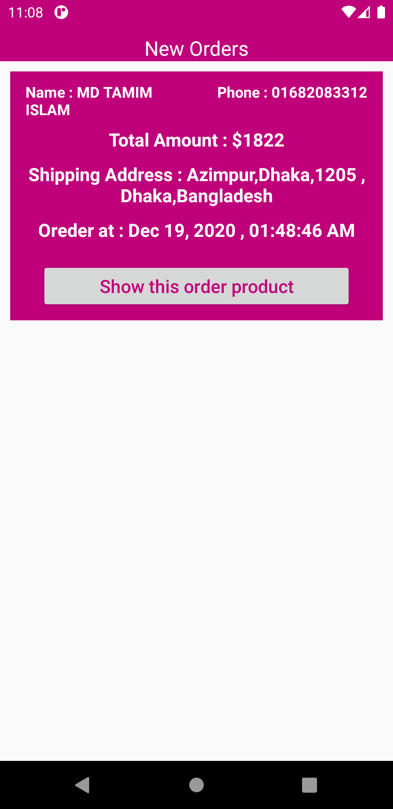

# E_Commerce_Project
My first E-commerce project.

if you like my project Click Start

following tutorial cooding cafe
#Noted that ,if you use this project ,Admin panale creted by your own way in Firebase .
#User panel,Amin panel,Seller panel
#All data are publis by Admin and seller item approved by admin.
#Using firebase database,Stoarage to send and show data.

1.      2.   3. 

4.      5.   6. 

7.      7.   6. 
