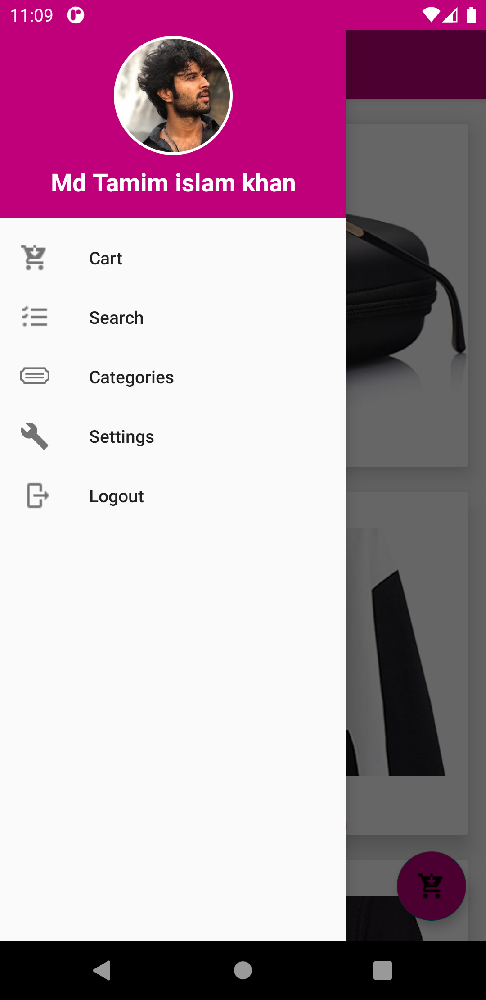
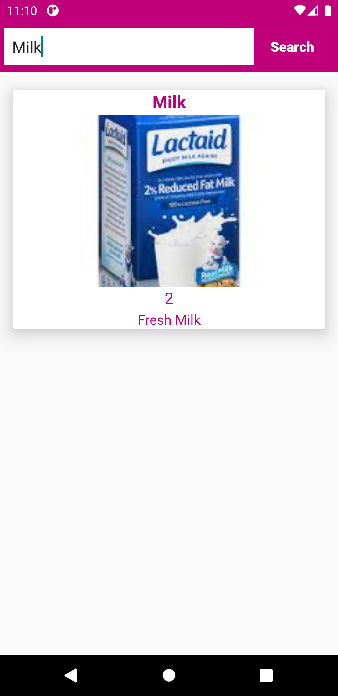
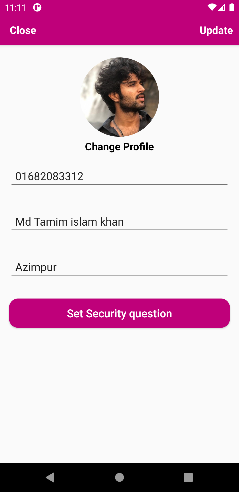
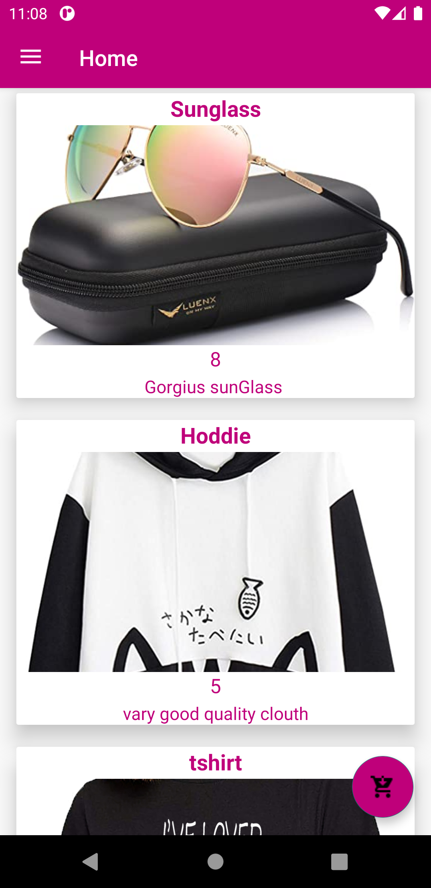
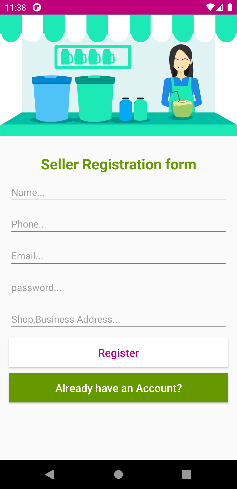
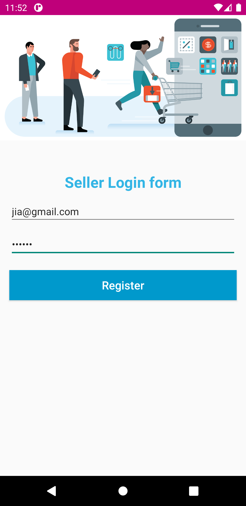
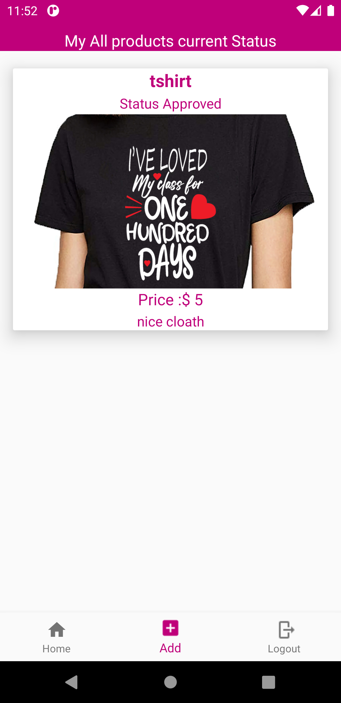
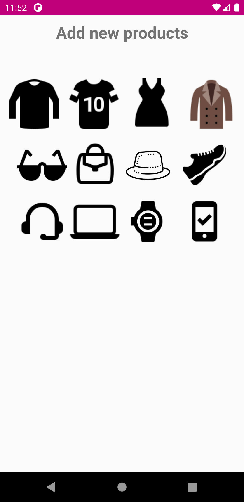

# E_Commerce_Project
My first E-commerce project.

if you like my project Click Start

following tutorial cooding cafe
#Noted that ,if you use this project ,Admin panale creted by your own way in Firebase .
#User panel,Amin panel,Seller panel
#All data are publis by Admin and seller item approved by admin.
#Using firebase database,Stoarage to send and show data.

1.  2.  3. 4.    

5.  6.  7. 8.    

9.  10.  11. 12.    
